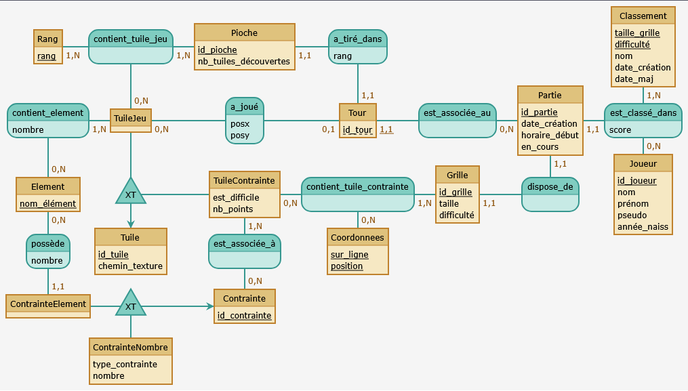

# Lost Seas - Version Web (Projet BDW)


Adaptation web du jeu de société **Lost Seas**, développée en Python selon une architecture **MVC (Modèle-Vue-Contrôleur)**.

Ce projet a été réalisé dans le cadre de l'unité d'enseignement "Base de Données et Programmation Web" (BDW) à l'Université Lyon 1.

## 📋 Fonctionnalités

* **Gestion de partie :** Création de parties, tours de jeu, gestion de la pioche et du plateau.
* **Base de données :** Persistance des joueurs, des parties et des scores via PostgreSQL.
* **Gameplay complet :** Implémentation des règles de placement, des contraintes de score et des bonus.
* **Statistiques :** Classements des meilleurs joueurs, historiques des parties.

## 🛠️ Architecture Technique

Le projet respecte une séparation stricte des responsabilités :
* **Modèle (`model_pg.py`) :** Interaction avec la base de données PostgreSQL (requêtes SQL paramétrées).
* **Vues (Templates Jinja2) :** Génération dynamique des pages HTML.
* **Contrôleurs :** Gestion de la logique métier et des routes.

### 🗃️ Modèle de Données (Schéma Entité-Association)


## 📂 Structure du Projet

```text
.
├── .gitignore
├── README.md
├── LICENSE                     # Licence MIT du projet
│
├── planning/                   # Documentation et conception BDD
│   ├── Modèle Relationnel.txt
│   ├── Schéma Entité-Association Mocodo.txt
│   └── Schéma_EA.png
│
└── serveur/                    # Code source du serveur et de l'application
    ├── config-bd.toml.example  # Exemple de config BDD (à renommer)
    ├── requirements.txt        # Liste des dépendances Python
    ├── serveur.py              # Script principal du serveur web
    │
    └── site/                   # Racine de l'application web
        ├── init.py
        ├── routes.toml         # Configuration du routage URL
        │
        ├── controleurs/        # Logique métier (C du MVC)
        │   ├── accueil.py
        │   ├── jeu.py
        │   └── ...
        │
        ├── model/              # Accès aux données (M du MVC)
        │   └── model_pg.py
        │
        ├── templates/          # Vues HTML/Jinja2 (V du MVC)
        │   ├── base.html
        │   ├── jeu.html
        │   └── ...
        │
        ├── initialisation_bd/  # Scripts SQL
        │   ├── script_a_executer.sql
        │   └── fichiersBD/
        │
        └── static/             # Ressources statiques (CSS, Images)
            ├── css/
            └── img/
```

## 🚀 Installation et Lancement

### Prérequis
* Python 3.11+
* PostgreSQL

### 1. Préparation de l'environnement

Placez-vous dans le répertoire du serveur :

```bash
cd serveur
```

Créez et activez l'environnement virtuel :
* **Création :** `python3 -m venv .vebdw`
* **Activation (Linux/Mac) :** `source .vebdw/bin/activate`
* **Activation (Windows) :** `.vebdw\Scripts\activate`

### 2. Installation des dépendances

Une fois l'environnement activé, installez les paquets requis :

```bash
pip install --upgrade pip
pip install -r requirements.txt
```

### 3. Configuration de la Base de Données

1.  **Configuration du fichier :** Dans le dossier `serveur/`, renommez `config-bd.toml.example` en `config-bd.toml` et éditez-le pour y renseigner vos identifiants PostgreSQL.

2.  **Initialisation des tables :** Exécutez le script SQL unique pour créer les schémas et insérer les données de base :
    * `serveur/site/initialisation_bd/script_a_executer.sql`

### 4. Lancement du serveur

Toujours depuis le dossier `serveur/` avec l'environnement virtuel activé :

```bash
python serveur.py site
```

Le serveur démarrera et sera accessible à l'adresse : **http://localhost:4242**

### Options avancées du serveur

Le script `serveur.py` accepte plusieurs options pour personnaliser le lancement :

* **-p, --port** : Changer le numéro de port (par défaut `4242`).
* **-c, --config** : Chemin vers un autre fichier de configuration (par défaut `config-bd.toml`).
* **-r, --routes** : Chemin vers un autre fichier de routage (par défaut `routes.toml`).
* **-i, --init** : Chemin vers le fichier d'initialisation (par défaut `init.py`).
* **-t, --templates** : Chemin vers un autre répertoire de templates (par défaut `templates/`).

## 👥 Auteurs

* **Marius Ciserane**
* **Matthias Boullot**

*Remerciements à Fabien Duchateau et Nicolas Lumineau (Université Lyon 1) pour le squelette du serveur BDW.*