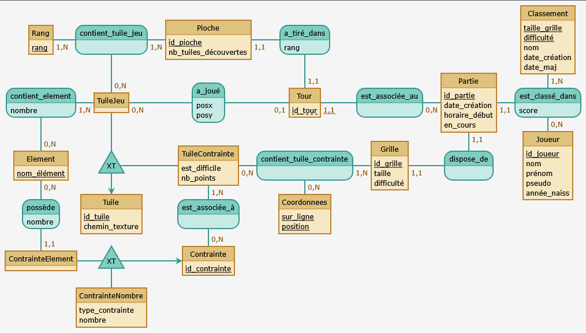

# Lost Seas - Version Web


Adaptation web du jeu de société **Lost Seas**, développée en Python selon une architecture **MVC (Modèle-Vue-Contrôleur)**.
Projet réalisé dans le cadre de l'UE "Base de Données et Programmation Web" (S4, Polytech Lyon).

## Fonctionnalités

* **Gestion de partie :** Création de parties, tours de jeu, gestion de la pioche et du plateau.
* **Base de données :** Persistance des joueurs, des parties et des scores.
* **Gameplay :** Implémentation des règles et contraintes de score.
* **Statistiques :** Classements, historique et autres statistiques.

## Architecture Technique

* **Modèle :** `model_pg.py` (SQL paramétré).
* **Vues :** Templates Jinja2.
* **Contrôleurs :** Logique métier en Python.

### Conception (Schéma Entité-Association)


## Structure du Projet

```text
.
├── README.md
├── LICENSE
├── planning/                   # Conception BDD
└── serveur/
    ├── config-bd.toml.example
    ├── requirements.txt
    ├── serveur.py
    └── site/
        ├── controleurs/
        ├── model/
        ├── templates/
        ├── initialisation_bd/  # Scripts SQL
        └── static/
```

## Installation

1. **Environnement virtuel :**

```bash
cd serveur
python3 -m venv .vebdw
source .vebdw/bin/activate  # Linux/Mac
.vebdw\Scripts\Activate   # Windows
```

2. **Dépendances :**

```bash
pip install --upgrade pip
pip install -r requirements.txt
```

3. **Configuration de la Base de Données :**
Dans le dossier `serveur/` :
	* Renommez `config-bd.toml.example` en `config-bd.toml` et modifiez les identifiants.
	* Exécutez le script SQL : `site/initialisation_bd/script_a_executer.sql`.

4. **Lancement du serveur :**

```bash
python serveur.py site
```
Serveur accessible sur `http://localhost:4242`.

## Auteurs

* **Marius CISERANE**
* **Matthias BOULLOT**

## Licence

Ce projet est sous licence MIT - voir le fichier [LICENSE](LICENSE) pour plus de détails.